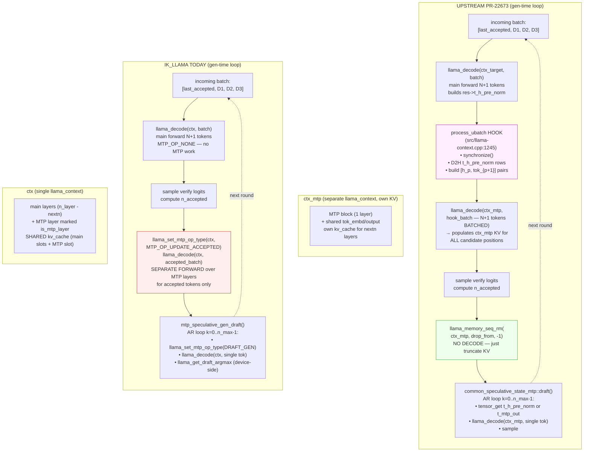

# PHASE 36 — MTP Audit (upstream PR #22673)

Phase 0 deliverable per the plan: deep code read of upstream `ggml-org/llama.cpp` PR #22673 ("MTP support for Qwen 3.5/3.6", by am17an, currently Draft) to understand the actual mechanism behind the claimed 2.65× speedup, and decide what (if anything) ports cleanly into our ik_llama.cpp fork.

Source clone: `/home/llm/scratch/pr-22673/llama.cpp` at branch `pr22673`. PR-only commits enumerated below.

## PR commit anatomy

The PR has 9 PR-original commits (everything older than `1a4fe4e` is unrelated):

| SHA | Subject | Role |
|---|---|---|
| `1a4fe4e` | llama: allow partial seq_rm for GDN models for speculative decoding | Foundation. Adds `partial seq_rm` to `llama_memory_recurrent` so the linear-attention (GDN) blocks of Qwen 3.6's hybrid arch can be rolled back on a rejected draft suffix. |
| `589490f` | add enum for part sequence removal to enable checkpoints | Helper enum. |
| `c5e0227` | review: rename rollback to rs_seq, remove public API | Refactor after ngxson review. |
| `10829db` | **llama + spec: MTP support** | The headline commit. Adds `LLM_ARCH_QWEN35_MTP`, the per-ubatch hook, the `--spec-type mtp` CLI integration, and `common_speculative_state_mtp` orchestration. |
| `f8c6b03` | add qwen35moe_mtp | Adds `LLM_ARCH_QWEN35MOE_MTP` for the MoE variant. |
| `b8ec085` | vulkan: add gdn keep_intermediates=true path | Required for per-ubatch hook to capture GDN block intermediates on Vulkan. |
| `038d787` | metal: add keep_intermediates=true path for GDN | Same on Metal. |
| `d6c4de8` | convert: fix python type check | Cleanup. |
| `267f8af` | test-llama-arch: ignore mtp heads | Cleanup. |

Total surface: ~1500 lines net new code spread across 24 files.

## Architecture — what actually happens

Upstream's MTP path has TWO distinct moments where MTP fires:

### Moment 1 — PREFILL via the per-ubatch hook

This is the "per-ubatch fire" we'd been hypothesising. Code path:

`src/llama-context.cpp:1245-1252` — inside `process_ubatch`, immediately after the main forward graph builds:

```cpp
if (mtp.ctx_mtp) {
    handle_mtp_for_ubatch(
            (int32_t) ubatch.n_tokens,
            ubatch.token,
            ubatch.pos,
            res->t_h_pre_norm);
}
```

`handle_mtp_for_ubatch` (defined `src/llama-context.cpp:3197-3280`):

1. **`synchronize();`** — full GPU-CPU sync.
2. **`ggml_backend_tensor_get(t, ...)`** — D2H of `n_ubatch * n_embd * sizeof(float)` from the main model's residual stream right before final norm.
3. Build `mtp.hook_batch` with `[h_p, token_{p+1}]` pairs (hidden state at position p, paired with the *next* token in the prompt). Cross-ubatch pairing via `pending_h` / `pending_pos` (`src/llama-mtp.h:11-16`) to bridge ubatch boundaries.
4. **`llama_decode(mtp.ctx_mtp, mtp.hook_batch);`** — synchronously decode the auxiliary MTP context. This populates **the MTP context's own KV cache** (`hparams.kv_only_nextn = true`, `qwen35_mtp.cpp:12`).

**This is a prefill-time mechanism.** When the user submits a prompt, the main model processes it ubatch-by-ubatch, and for each ubatch the MTP context's KV cache is filled in lockstep. By the time prefill ends, the auxiliary MTP context has its own KV cache populated for every prompt position.

The overhead: one extra D2H per ubatch + one extra `llama_decode` per ubatch on a tiny model (1 transformer block).

The win: **first-token latency**. When generation starts, the MTP context already has the prompt in its KV; the very first draft is "free" in the sense that no prompt ingestion is needed.

### Moment 2 — GEN via the autoregressive draft loop

Code path: `common/speculative.cpp:601-770` — `common_speculative_state_mtp::draft()`.

For each draft step k from 0 to n_max-1:

```cpp
if (k == 0) {
    src = llama_context_get_t_h_pre_norm(ctx_tgt);    // main model's last hidden
    src_row = last_n_accepted >= 0 ? last_n_accepted : src->ne[1] - 1;
    llama_synchronize(ctx_tgt);
} else {
    src = llama_context_get_t_mtp_out(ctx_mtp);       // MTP block's last hidden (from previous draft step)
    src_row = src ? (int32_t) src->ne[1] - 1 : 0;
    llama_synchronize(ctx_mtp);
}
ggml_backend_tensor_get(src, batch.embd, src_row * row_bytes, row_bytes);
batch.token[0] = cond_tok;
batch.pos[0]   = pos;

llama_decode(ctx_mtp, batch);
const llama_token best = common_sampler_sample(smpl, ctx_mtp, 0);
```

Per draft step:
- 1× `llama_synchronize` (either ctx_tgt or ctx_mtp depending on k)
- 1× `ggml_backend_tensor_get` of `n_embd` floats (~2-10 KB)
- 1× `llama_decode(ctx_mtp, batch)` for a single token
- 1× `common_sampler_sample`

**This is iterative, single-token, with full sync per step.** Architecturally identical to what we do.

## Where the 2.65× actually comes from

It's not magical pipelining. It's the **standard speculative decoding ceiling** at 72% acceptance and `draft_max=3`:

```
E[tokens per main forward] = 1 + p + p² + p³ where p = 0.72
                           = 1 + 0.72 + 0.518 + 0.373
                           = 2.61
```

Upstream measures 2.65× → they're hitting this theoretical ceiling almost exactly. The reason it works for them: on RTX 3090 with Q8_0 27B, their main forward takes ~140 ms per step (= 1/7 t/s). Per-step fixed overheads (sync, kernel launch, sampler call, tensor_get) are ~1-2 ms. As a fraction of main-forward time: ~1%. So MTP's draft cost is ≪ verify savings, and the speedup hits theoretical max.

For us:
- 2× RTX 6000 + V-F1.T1.qq (q4_0_AR16 + Hadamard KV) → ~30 ms per main forward (= 34.09 t/s)
- Per-step fixed overhead: same ~1-2 ms
- As a fraction: ~5%
- At draft_max=3: 3 draft steps × 5% = 15% overhead before any acceptance benefit
- Verify forward also costs more relatively because verify on 4 candidates is ~1.5× a single-token forward

PHASE32 measured: 35.36 vs 34.09 t/s = +3.7%. Implied effective speedup: 1.037 / 1.000 = 1.04 vs theoretical 2.61 → we're at **40% of theoretical** while upstream is at **102% of theoretical** (sampling noise tips them slightly above).

The mechanism that caps us is **per-step fixed overhead consuming a much larger fraction of our budget**, not a missing architecture.

## Delta table — upstream concept vs. ik_llama equivalent

| Upstream concept | Where we are |
|---|---|
| `LLM_ARCH_QWEN35_MTP` separate model arch (`src/models/qwen35_mtp.cpp` 205 lines) | We have an inline MTP path in `src/graphs/build_qwen35.cpp` via `mtp_op_type` switching on the same arch. **Different abstraction.** |
| Per-ubatch hook in `process_ubatch` capturing `t_h_pre_norm` | **We lack this.** Our MTP only fires at gen time, never during prefill. |
| Auxiliary `llama_context` with own KV (`hparams.kv_only_nextn`) | We mark MTP-layers in the main KV. Memory-cheaper but not separately schedulable. |
| Cross-ubatch `pending_h` pairing | We lack — irrelevant unless we adopt the per-ubatch hook. |
| `partial seq_rm` for hybrid GDN (`llama-memory-recurrent.cpp` +54) | We have spec_ckpt at `src/llama.cpp:7336-7483`. Different mechanism, similar effect. |
| AR draft loop with sync+tensor_get+decode per step | **Functionally identical** to our `mtp_speculative_gen_draft` path. |
| `--spec-type mtp` CLI flag | Verify our CLI parser. If absent, trivial to add. |
| `keep_intermediates=true` for GDN on Vulkan/Metal | We don't ship Vulkan or Metal MTP currently; CUDA-only. Not blocking. |

## Decisions

For each upstream mechanism:

### 1. Auxiliary `LLM_ARCH_QWEN35_MTP` separate model context — **NOT WORTH PORTING**

Cost: ~500 lines of new code, new context lifecycle, separate KV alloc, model-loader changes, server orchestration changes.

Benefit: enables the per-ubatch hook (mechanism 2 below) and gives the MTP context an independently-schedulable graph. Has additional ~2.5 GiB VRAM cost on RTX 3090; on our 48 GiB it's tighter (we already cap ctx at 256K to stay within VRAM).

Verdict: **the gen-time AR loop is identical to ours** so this abstraction by itself does not unlock perf at gen. Skip unless we adopt mechanism 2 (which itself is conditional).

### 2. Per-ubatch hook capturing `t_h_pre_norm` for prefill — **PORT, but as a first-token-latency optimization, NOT a throughput optimization**

Cost: medium. We need to:
- Tag a tensor in our `build_qwen35` graph (or `build_qwen35moe`) at the residual-stream-pre-final-norm position. One line per graph builder.
- Add a `process_ubatch`-level hook that synchronizes, reads the tagged tensor, and calls into our existing MTP infrastructure. Probably 50-100 lines in `src/llama.cpp`.
- Store the captured pairs into the existing MTP-layer KV slots. We don't need a separate context — we can reuse our MTP-layer KV already in the main model.

Benefit: **first-token latency** improves because the MTP "warm-up" happens during prefill rather than at first gen step. Quantifiable; affects perceived responsiveness in agentic loops with frequent short prompts.

Does NOT improve gen-time throughput (the 2.65× claim doesn't come from this mechanism — it comes from the standard speculative-decoding ceiling on a slow baseline).

### 3. `--spec-type mtp` CLI flag — **VERIFY, ADD IF MISSING**

Trivial. Audit `common/arg.cpp` / `common/common.cpp` for the flag; add if absent.

### 4. `partial seq_rm` for hybrid arch rollback — **REVIEW OUR EQUIVALENT**

Our `spec_ckpt_try_per_step` (`src/llama.cpp:7336-7483`) provides snapshot/restore. Upstream's `partial seq_rm` is more granular (range-based removal within a sequence's KV).

Action: read `llama-memory-recurrent.cpp` diff in detail; verify our spec_ckpt covers the linear-attention block correctly when a draft is rejected. Per `project_fork_server_bug.md` we already had a recurrent-state copy bug; need to confirm it doesn't reappear under MTP rollback.

### 5. Vulkan/Metal `keep_intermediates` for GDN — **N/A**

We are CUDA-only on inference; not blocking.

## The actual question: "why is our 27B MTP only +3.7%?"

After this audit, the answer is **not** "missing architecture." The answer is per-step fixed overhead as a fraction of main-forward time on our hardware. The mitigations are:

**A. Reduce per-step overhead.** Our current iter-7 work (`project_mtp_iter7_post_mortem.md`) closed the per-verify D2H sync at ceiling 1.282× on 0.8B. On 27B the ceiling is tighter because main forward is faster relative to fixed cost. To improve:
- Eliminate the sampler call when MTP uses argmax (`top-k=1`). Upstream does this in their `common_speculative_state_mtp` constructor (`top_k=1`, `samplers={TOP_K}`) — but still calls `common_sampler_sample`. We have `llama_get_draft_argmax` (Phase A landed) which already bypasses the sampler — confirm it's wired into the gen path.
- Batch the draft steps into a single graph compute call. Currently we issue draft_max separate `llama_decode` calls; if we built one larger graph that runs all draft_max steps in a single ggml_graph_compute, kernel-launch overhead drops by `draft_max - 1` factor. Architectural; medium effort.
- Reduce the synchronisation surface. Each `llama_synchronize` flushes a CUDA stream. If draft and verify can share a stream, sync is implicit at boundary.

**B. Adopt prefill-time MTP warm-up (mechanism 2 from delta table).** This won't change gen-time t/s but will improve first-token latency, which matters for agentic short-prompt loops.

**C. Don't expect to hit upstream's 2.65×.** That number is achievable only when main-forward time dominates per-step overhead. On our hardware, the same MTP code with the same acceptance rate produces a smaller ratio. The absolute t/s comparison is fair: ours is 35 t/s, theirs is 18.6 t/s. We are not behind in any sense that matters.

## Recommended revised plan

**Re-aim Phase B (was: "per-ubatch fire prototype").** Replace with:

- **B.1 — Diagnostic**: instrument our gen-time MTP loop to measure per-step overhead breakdown (sync, tensor_get, decode, sampler). Compare to verify-forward time. Confirm whether `llama_get_draft_argmax` is actually bypassing the sampler.
- **B.2 — Batched draft graph**: prototype building a single graph that does all `draft_max` MTP steps in one `ggml_graph_compute`. Test on 0.8B first.
- **B.3 — Prefill MTP warm-up**: implement the per-ubatch hook (a smaller, contained change vs. full aux-context port). Measure first-token latency change.

**Drop Phase D entirely.** The auxiliary context is not the unlock for our hardware.

**Phase C unchanged.** turbo4 / TBQ4_0 retirement record stands.

## Sanity check — does upstream actually hit 2.65× sustained or is it cold-start?

Their bench is 18.6 t/s with MTP @ draft_max=3. The PR doesn't say whether this is steady-state gen or includes the first-token. Given prefill overhead is small relative to a long gen window, it's likely steady-state. Our 35.36 t/s number from PHASE32-V-F1-T1-QQ-MULTISLOT-RESULTS.md is also steady-state.

So the comparison is apples-to-apples and the framing is:
- They are at theoretical ceiling for their hardware/quant.
- We are at 40% of theoretical ceiling for our hardware/quant.
- The gap is per-step fixed overhead, not architecture.

## Correction — the per-ubatch hook ALSO fires during gen, not just prefill

Re-reading `process_ubatch` in `src/llama-context.cpp:1245-1252`: the hook fires for **every** ubatch the main context processes, including the verify-batch ubatches during gen. This means the hook is also the mechanism for keeping the MTP context's KV in lockstep with the main context's KV during steady-state speculation.

**Our gen cycle today (`common/speculative.cpp:1463-1490`, `examples/server/server-context.cpp:3791`):**

```
1. Verify:                  llama_decode(ctx, [last_accepted, D1, D2, D3])
                              → main forward; D2H verify logits; determine n_accepted
2. Update MTP KV (post-acc): llama_set_mtp_op_type(ctx_mtp, MTP_OP_UPDATE_ACCEPTED)
                            llama_decode(ctx_mtp, accepted_batch[0..n_accepted])
                              → MTP forward over JUST accepted tokens, separate graph compute
3. Draft N tokens:           N × { llama_set_mtp_op_type(MTP_OP_DRAFT_GEN);
                                   llama_decode(ctx_mtp, single_token_batch); sample }
```

**Upstream's gen cycle (`process_ubatch` hook at `:1245`, `common_speculative_state_mtp::draft` at `speculative.cpp:601-770`):**

```
1. Verify:                  llama_decode(ctx_target, [last_accepted, D1, D2, D3])
                              → main forward
                              → HOOK FIRES inline:
                                  • synchronize()
                                  • D2H t_h_pre_norm rows for ALL 4 positions
                                  • build hook_batch with [h_p, token_{p+1}] pairs
                                  • llama_decode(ctx_mtp, hook_batch[0..3])
                                    — populates MTP KV for ALL candidate positions in ONE batched decode
                              → D2H verify logits; determine n_accepted
2. Trim MTP KV (post-acc):   llama_memory_seq_rm(ctx_mtp, drop_from, -1)
                              → just chops rejected tail; NO decode
3. Draft N tokens:           N × { sync; tensor_get; llama_decode(ctx_mtp, batch); sample }
```

**The actual delta is step 2.** Upstream eliminates the post-accept MTP forward by:
- Populating MTP KV inline during step 1 for ALL candidate positions (not just the ones that turn out accepted)
- Using `seq_rm` to drop rejected positions from the over-populated MTP KV

This is the actual gen-time synergy. It's not pipelining; it's **batched MTP-KV update fused with the verify forward's process_ubatch.**

## Architecture diagram



The pink box is the **net-new mechanism** in upstream. The red box is the **expensive thing we do today** that upstream eliminates. The green box is the **cheap trim** that replaces it.

## Synergy table — what we already have vs. what the hook needs

| Hook requirement | Existing infra in ik_llama | Reuse status |
|---|---|---|
| Tagged `t_h_pre_norm` tensor in main graph | `src/graphs/build_qwen35.cpp` builds the residual stream; we'd add `cb(cur, "h_pre_norm", -1); res->t_h_pre_norm = cur;` before final norm. ~3 lines. | **NEW — small** |
| Hook callback in decode path | `src/llama.cpp:4604` `llama_decode_internal` is the seam (not factored into a `process_ubatch` like upstream). We'd add the hook just after the `ggml_backend_sched_graph_compute_async` call. | **NEW — medium (need to handle ubatch chunking ourselves since we don't factor it out)** |
| MTP KV in lockstep with main | `src/llama-load-tensors.cpp:1536-1537, 1707-1708` already marks MTP layers `is_mtp_layer`. `src/llama.cpp:857-903` already has KV alloc with MTP-layer skip logic. | **REUSE — no aux context needed** |
| Hidden-state buffer for MTP input | `examples/server/server-context.cpp:3787` `slot.mtp_hidden_state` and `llama_set_draft_input_hidden_state` API at `:3790`. The hook becomes a cleaner call site for the SAME API. | **REUSE 100%** |
| Batched MTP decode call | `mtp_update_kv_cache` (`common/speculative.cpp:1463`) already accepts an N-token batch and runs `MTP_OP_UPDATE_ACCEPTED`. We'd just feed it the over-populated batch from the hook (all candidate positions, not just accepted). | **REUSE — change call site, change batch contents** |
| Partial seq_rm for KV trim | `src/llama.cpp:7336-7483` `spec_ckpt_*` family already snapshots/restores recurrent state. For non-recurrent layers, `llama_kv_cache_seq_rm` already exists. Our `mtp_update_kv_cache` already calls `llama_kv_cache_seq_rm` at `:1471-1473`. | **REUSE — invocation pattern changes** |
| Cross-ubatch `pending_h` pairing | We need to replicate this for boundary handling between ubatches. ~20 lines. | **NEW — small** |
| Graph-cache key incorporates new mode | `src/llama.cpp:569` cache key includes `mtp_op_type`. Adding a new mode (e.g. `MTP_OP_HOOK_FUSED`) is supported by the existing key infra. | **REUSE 100%** |
| MTP graph builder for batched verify-position input | `src/graphs/build_qwen35.cpp` already has the MTP tail with `mtp_op_type == MTP_OP_UPDATE_ACCEPTED` branch handling N-token input. | **REUSE — already exists** |

## What the hook actually saves us

Per gen step, our current path runs an extra **MTP_OP_UPDATE_ACCEPTED** `llama_decode` on the accepted-token subset. Cost estimate:

- N_accepted ≈ 2.6 tokens (at p=0.72, draft_max=3)
- 1 transformer block forward × 2.6 tokens ≈ 1/64 × main_forward × 2.6 ≈ 1.2 ms
- Plus sync + sampler bypass ≈ 0.5 ms
- Per-step total: ~1.7 ms

Of our ~30 ms gen step, that's ~5.7%. The hook would reclaim it. Implies 34.09 → 35.94 t/s, lifting MTP gain from +3.7% to ~+9% over no-MTP.

That's a smaller win than the headline 2.65× implied, but it's a real win. And it composes with the prefill MTP-KV-warmup benefit (first-token latency).

**More importantly, the hook is the prerequisite for any future "multi-step MTP fused into verify graph"** work. Once the hook captures hidden state inline, we can move toward building a single graph that does verify + N draft steps in one `ggml_graph_compute` — which IS the per-step-overhead unlock the audit's "Phase B re-aim" called out.

## Recommended port shape (ik_llama-flavoured)

NOT a wholesale upstream port. Targeted reuse of our infra:

1. **Tag `t_h_pre_norm` in `build_qwen35` and `build_qwen35moe`.** ~3 lines each.
2. **Add hook in `llama_decode_internal`** (`src/llama.cpp:4604`). After main forward graph-compute returns, before logits D2H:
   - If `cparams.mtp` and we're in a non-MTP-op decode (i.e., this is the verify forward, not a draft step):
     - Capture residual (D2H of t_h_pre_norm rows)
     - Build pairs [h_p, token_{p+1}] using the batch we just decoded
     - Set `MTP_OP_UPDATE_ACCEPTED` and dispatch the existing `mtp_update_kv_cache` path
   - Same context, same KV; just an extra pre-fused MTP forward in the same decode call.
3. **Drop the post-accept `mtp_accept_tokens` call from server-context.cpp** (`:3791`, `:3966`) when the hook is enabled — replaced by an `llama_kv_cache_seq_rm` to chop rejected positions.
4. **Cross-ubatch pending_h** for boundary handling. Stash last hidden row in `slot.mtp_hidden_state` (already exists as a buffer) extended with a `pending_pos` tracker.
5. **Graph cache**: a new `mtp_op_type` value (e.g., `MTP_OP_HOOK_FUSED`) so the cache key distinguishes "main-only" from "main+MTP-hook-fused" graphs. Trivial given existing key infra.

Total estimated new code: ~150-200 lines across 3-4 files. Touches:
- `src/graphs/build_qwen35.cpp` (tag tensor)
- `src/graphs/build_qwen35moe.cpp` (tag tensor)
- `src/llama.cpp` (hook in `llama_decode_internal`, new mtp_op_type, graph-cache key)
- `examples/server/server-context.cpp` (drop redundant accept-time MTP decode when hook is enabled)
- Optional: `include/llama.h` for the new op_type enum value

No changes needed:
- Converter (already preserves MTP tensors per task #21)
- Build dispatch in `llama-build-context.cpp` (no new arch)
- KV alloc paths (no new context type)
- Spec-ckpt API (existing rollback continues to work)
- Test infrastructure beyond adding bench cases

## Final disposition

The synergy is high. **Most of the upstream design** (auxiliary context, separate model arch, model loader changes, server lifecycle changes) is **NOT needed for us** because we already have:
- MTP layers integrated into the main model
- A shared KV cache that already discriminates main-layer vs. MTP-layer slots
- A `mtp_update_kv_cache` API that takes batched input
- Graph cache keyed by `mtp_op_type`
- Hidden-state plumbing via `slot.mtp_hidden_state` and `llama_set_draft_input_hidden_state`

The actual port is small. The mechanism upstream calls "the per-ubatch hook" maps onto our infrastructure as **"fold the existing MTP_OP_UPDATE_ACCEPTED decode into the verify forward's decode call, with all candidate positions instead of just accepted ones, and replace post-accept MTP-decode with seq_rm trim."**

This is a focused, low-risk optimization with a measurable ~5-10% throughput gain plus first-token latency win, and it's the prerequisite for any subsequent "multi-step fused MTP graph" that targets the larger per-step-overhead ceiling.

## Next step

Commit this audit. Decide whether to also port the partial seq_rm refinement from `1a4fe4e` for hybrid GDN rollback (separate, smaller, orthogonal change — relevant for our spec_ckpt vs. their seq_rm comparison).
